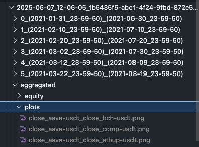
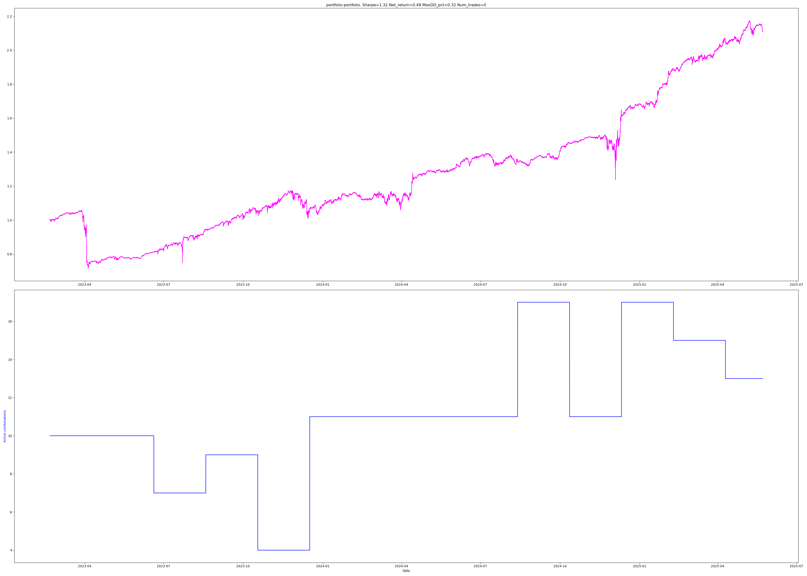
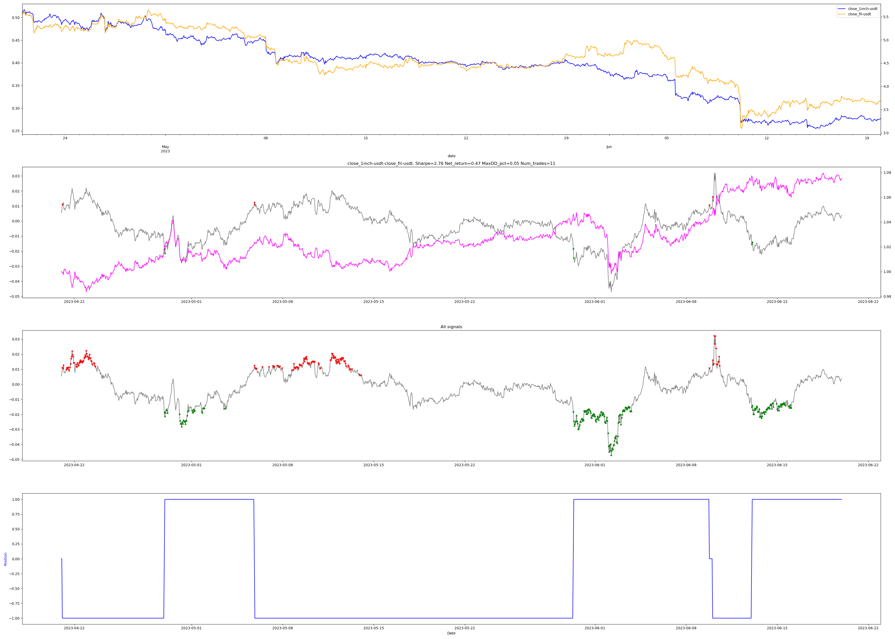

# wqu-capstone

## 1. Overview
This research explores a new approach to pair trading strategy in the cryptocurrency
market, based on the assumption that the price spread between carefully selected,
cointegrating crypto assets generally exhibits stationary tendencies, thus making it a good
fit candidate for machine learning (ML) techniques. We propose a
hierarchical modeling approach to generate robust trading signals composed of a bottom
and top model. The bottom model predicts future spread movements and generates trading
signals. To enhance the strategy’s reliability and adapt to market regime shifts, we
introduce a top-level filtering mechanism by utilizing a ML model for
dynamic regime detection and acting as a gatekeeper to selectively activate the signals
generated by the bottom-level model. The expected outcome of this research is a
demonstrably effective and adaptive pair trading strategy that leverages the predictive
power of hierarchical ML models to exploit the statistical arbitrage opportunity, especially in
the cryptocurrency market.

## 2. Preparation and Execution

> [!NOTE]
> This experiment is conducted using Python version 3.12.x and tested on UNIX based operations system (LINUX, MACOS, WSL).

#### **Step 1: Install `uv` package manager**
        
```bash
curl -LsSf https://astral.sh/uv/install.sh | sh
```

Reference: [uv official docs - installation](https://docs.astral.sh/uv/getting-started/installation/)

#### **Step 2: Run backtesting script**

> [!WARNING]
> Running this backtesting script can take several hours to complete due to intensive computations, even with parallel processing enabled. The actual speed will vary depending on your hardware specifications.

```bash
uv run test.py
```

> [!NOTE]
> The results from the backtesting process will be stored in the generated `./results` folder. This folder contains CSV files with experiment information, history, statistics, metrics, and more. Additionally, visualizations of the trading strategy will be available as image files.



## 3. Project Structure
### 3.1 Data
Dataset files can be found under `./dataset` directory.

Dataset file name: `binance_1h_ohlcv_2021-2025.parquet`

This dataset contains 5 years of hourly cryptoccurencies data retrieved from Binance Exchange with the following properties:
   - open price
   - high price
   - low price
   - close price
   - trade volume
   - datetime

### 3.2. Scripts
   - `test.py`
   
     The main backtesting script entry point and responsible for configuring backtesting strategy parameter.

   - `backtester.py`
   
     Backtesting class with a set of functionalities.

   - `combinations.py`
     
     Responsible for generating the pair combinations and performing pair selection.

   - `comovement.py`
     
     Contains cointegration related functions such as cointegration test, calculate cointegration vector, and more.

   - `feature_engineering.py`
     
     Provides feature engineering related functions.
   
   - `spread.py`
   
     Responsible for calculating the spread.
   
   - `target_creation.py`
     
     Provides the functionalities to calculate the target label for supervised ML/DL models.
   
   - `bottop_prediction.py`

     Bottom model definition, training and inference (predict) logic, and more.

  - `top_model.py`

     Top model definition and related functionalities.

## 4. Result Snapshot

Reference: [complete backtest results and figures](https://www.google.com/url?q=https://www.dropbox.com/scl/fi/xrqfe46719laulexo9tfe/2025-06-14_21-16-08_257c32fd-c6d4-4f0c-b762-453847a10619.zip?rlkey%3Di3rlwg6cemqxt9idbh0obx7k3%26e%3D1%26dl%3D0&sa=D&source=docs&ust=1749963493037484&usg=AOvVaw0FRnBIrfGFlnsgyA2AMj6a)

|  |
|:--:| 
| Final aggregated ML driven pair trading stragegy result. |

|  |
|:--:| 
| A sample of the pair trading simulation over time. |

